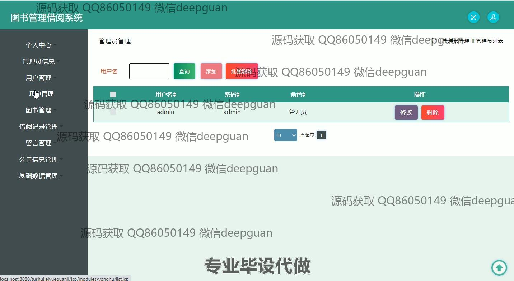
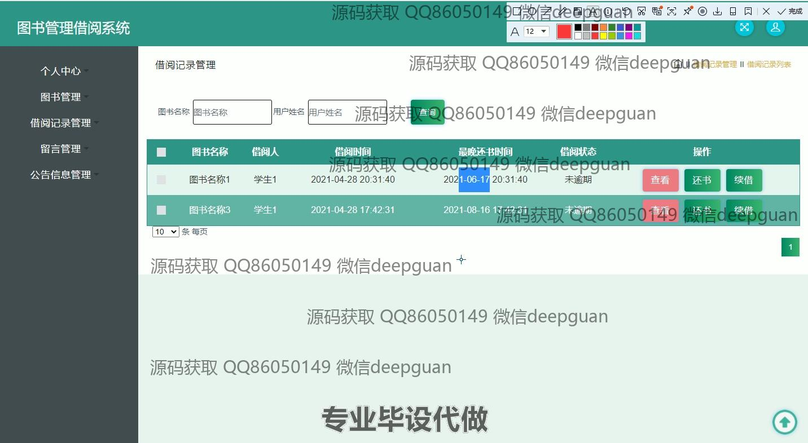

<h1 align="center">图书管理借阅系统</h1>

## 简介
图书管理借阅系统：角色分为管理员、用户；实现用户管理、图书管理、借阅记录管理、留言与公告管理、密码修改等功能，提高图书借阅效率与管理便捷性。    --计算机毕业设计源码；毕设源码；java毕业设计源码

## 联系方式

<h3 align="center">获取完整代码与数据库文件 + 微信：deepguan QQ: 86050149 QQ群: 783742310</h3>

<h3 align="center">可帮忙远程部署 包运行成功！提供远程部署、修改代码、设计文档指导、代码讲解等服务！</h3>

## 功能介绍（完整见运行截图）
管理员：管理员可以访问系统的各个模块，包括管理用户信息、图书信息和借阅记录。功能包括添加和删除管理员账户、修改管理员信息、管理用户的基本数据、处理用户的留言和公告信息，以及修改密码。管理员拥有对图书的全权限管理，能够添加、编辑、删除图书，设置图书库存与可借天数，并处理借阅请求。

用户：用户可以登录系统查看和管理个人信息，修改个人资料，如性别、联系方式、照片等。用户可浏览并搜索系统的图书信息、查看图书详情、进行借阅和归还操作。用户可以查看自身的借阅记录，包括借阅时间、最迟还书日期和当前状态，并执行还书和续借操作。同时拥有给图书写评价的权限， 还能查看系统播出的公告信息和留言。

## 运行截图

本代码来源于网络,仅供学习参考使用!

